# EPG Platform — Entity Relationship Diagram

Auto-generated from `apps/api/prisma/schema.prisma` by
`scripts/generate-er-diagram.js` (`pnpm generate:er-diagram`). Re-run after
any schema change — this file is not regenerated automatically or checked
in CI, so it can drift; treat it as a snapshot, not a live view.

```mermaid
erDiagram
    ORGANIZATION ||--o{ USER : "has"
    ORGANIZATION ||--o{ PROJECT : "has"
    ORGANIZATION ||--o{ RISK : "has"
    PROJECT ||--o{ RISK : "has"
    ORGANIZATION ||--o{ DECISION : "has"
    PROJECT ||--o{ DECISION : "has"
    ORGANIZATION ||--o{ ISSUE : "has"
    PROJECT ||--o{ ISSUE : "has"
    ORGANIZATION ||--o{ EXTERNAL_REFERENCE : "has"
    ISSUE ||--o{ EXTERNAL_REFERENCE : "has"
    ORGANIZATION ||--o{ CHANGE_REQUEST : "has"
    PROJECT ||--o{ CHANGE_REQUEST : "has"
    ORGANIZATION ||--o{ REQUIREMENT : "has"
    PROJECT ||--o{ REQUIREMENT : "has"
    ORGANIZATION ||--o{ REVIEW : "has"
    PROJECT ||--o{ REVIEW : "has"
    ORGANIZATION ||--o{ CHECKLIST_ITEM : "has"
    PROJECT ||--o{ CHECKLIST_ITEM : "has"
    ORGANIZATION ||--o{ CHECKLIST_TEMPLATE : "has"
    CHECKLIST_TEMPLATE ||--o{ CHECKLIST_TEMPLATE_ITEM : "has"
    ORGANIZATION ||--o{ DEPARTMENT : "has"
    ORGANIZATION ||--o{ SOP : "has"
    ORGANIZATION ||--o{ DOCUMENT : "has"
    PROJECT ||--o{ DOCUMENT : "has"
    DOCUMENT ||--o{ DOCUMENT_VERSION : "has"
    ORGANIZATION ||--o{ GOVERNANCE_GATE : "has"
    PROJECT ||--o{ GOVERNANCE_GATE : "has"
    ORGANIZATION ||--o{ CUSTOMER_SIGNOFF : "has"
    PROJECT ||--o{ CUSTOMER_SIGNOFF : "has"
    ORGANIZATION ||--o{ DEPLOYMENT_APPROVAL : "has"
    PROJECT ||--o{ DEPLOYMENT_APPROVAL : "has"
    ORGANIZATION ||--o{ NOTIFICATION : "has"
    PROJECT ||--o{ NOTIFICATION : "has"
    ORGANIZATION ||--o{ KNOWLEDGE_ARTICLE : "has"
    ORGANIZATION ||--o{ WEBHOOK_CONNECTOR : "has"
    ORGANIZATION ||--o{ PLUGIN_MANIFEST : "has"
    ORGANIZATION ||--o{ SECURITY_FINDING : "has"
    PROJECT ||--o{ SECURITY_FINDING : "has"
    ORGANIZATION ||--o{ EMAIL_LOG : "has"
    PROJECT ||--o{ EMAIL_LOG : "has"
    ORGANIZATION ||--o{ AUDIT_LOG : "has"
    PROJECT ||--o{ AUDIT_LOG : "has"
    ORGANIZATION {
        String id PK
        String name
        DateTime createdAt
        DateTime updatedAt
    }
    USER {
        String id PK
        String email
        String name
        String passwordHash
        Role role
        Boolean isActive
        String organizationId FK
        DateTime createdAt
        DateTime updatedAt
    }
    PROJECT {
        String id PK
        String name
        ProjectStatus status
        GovernanceStage governanceStage
        Json metadata
        String organizationId FK
        DateTime createdAt
        DateTime updatedAt
    }
    RISK {
        String id PK
        String organizationId FK
        String projectId FK
        String title
        String description
        RiskSeverity severity
        RiskLikelihood likelihood
        RiskStatus status
        DateTime createdAt
        DateTime updatedAt
    }
    DECISION {
        String id PK
        String organizationId FK
        String projectId FK
        String title
        String context
        String decision
        String decidedById FK
        DateTime decidedAt
        DateTime createdAt
        DateTime updatedAt
    }
    ISSUE {
        String id PK
        String organizationId FK
        String projectId FK
        String title
        String description
        IssuePriority priority
        IssueStatus status
        DateTime createdAt
        DateTime updatedAt
    }
    EXTERNAL_REFERENCE {
        String id PK
        String organizationId FK
        String issueId FK
        ExternalReferenceProvider provider
        String externalId FK
        String url
        DateTime createdAt
    }
    CHANGE_REQUEST {
        String id PK
        String organizationId FK
        String projectId FK
        String title
        String description
        ChangeRequestStatus status
        String requestedById FK
        DateTime createdAt
        DateTime updatedAt
    }
    REQUIREMENT {
        String id PK
        String organizationId FK
        String projectId FK
        String title
        String description
        RequirementStatus status
        DateTime createdAt
        DateTime updatedAt
    }
    REVIEW {
        String id PK
        String organizationId FK
        String projectId FK
        ReviewType type
        String title
        String description
        ReviewStatus status
        String requestedById FK
        DateTime createdAt
        DateTime updatedAt
    }
    CHECKLIST_ITEM {
        String id PK
        String organizationId FK
        String projectId FK
        String title
        Boolean isDone
        DateTime createdAt
        DateTime updatedAt
    }
    CHECKLIST_TEMPLATE {
        String id PK
        String organizationId FK
        String name
        String description
        DateTime createdAt
        DateTime updatedAt
    }
    CHECKLIST_TEMPLATE_ITEM {
        String id PK
        String templateId FK
        String title
        Int order
    }
    DEPARTMENT {
        String id PK
        String organizationId FK
        String name
        String parentId FK
        Department parent
        Department children
        DateTime createdAt
        DateTime updatedAt
    }
    SOP {
        String id PK
        String organizationId FK
        String title
        String category
        String content
        DateTime createdAt
        DateTime updatedAt
    }
    DOCUMENT {
        String id PK
        String organizationId FK
        String projectId FK
        String title
        String url
        String storageKey
        String version
        DateTime createdAt
        DateTime updatedAt
    }
    DOCUMENT_VERSION {
        String id PK
        String documentId FK
        String version
        String url
        String storageKey
        DateTime createdAt
    }
    GOVERNANCE_GATE {
        String id PK
        String organizationId FK
        String projectId FK
        GateCategory category
        String title
        Boolean isMet
        DateTime createdAt
        DateTime updatedAt
    }
    CUSTOMER_SIGNOFF {
        String id PK
        String organizationId FK
        String projectId FK
        String title
        String customerName
        SignoffStatus status
        String requestedById FK
        String notes
        DateTime createdAt
        DateTime updatedAt
    }
    DEPLOYMENT_APPROVAL {
        String id PK
        String organizationId FK
        String projectId FK
        String title
        DeploymentStatus status
        String requestedById FK
        String notes
        DateTime createdAt
        DateTime updatedAt
    }
    NOTIFICATION {
        String id PK
        String organizationId FK
        String projectId FK
        String recipientId FK
        String title
        String body
        Boolean isRead
        DateTime createdAt
    }
    KNOWLEDGE_ARTICLE {
        String id PK
        String organizationId FK
        String title
        String category
        String tags
        String content
        DateTime createdAt
        DateTime updatedAt
    }
    WEBHOOK_CONNECTOR {
        String id PK
        String organizationId FK
        String name
        WebhookProvider provider
        String encryptedUrl
        Boolean isActive
        DateTime createdAt
        DateTime updatedAt
    }
    PLUGIN_MANIFEST {
        String id PK
        String organizationId FK
        String name
        String version
        String description
        Json manifest
        Boolean isEnabled
        DateTime createdAt
        DateTime updatedAt
    }
    SECURITY_FINDING {
        String id PK
        String organizationId FK
        String projectId FK
        String title
        String description
        SecurityFindingSeverity severity
        SecurityFindingStatus status
        DateTime discoveredAt
        DateTime createdAt
        DateTime updatedAt
    }
    EMAIL_LOG {
        String id PK
        String organizationId FK
        String projectId FK
        String recipientEmail
        String subject
        String body
        DateTime createdAt
    }
    AUDIT_LOG {
        String id PK
        String organizationId FK
        String projectId FK
        String actorId FK
        String action
        Json metadata
        String previousHash
        String hash
        DateTime createdAt
    }
```

